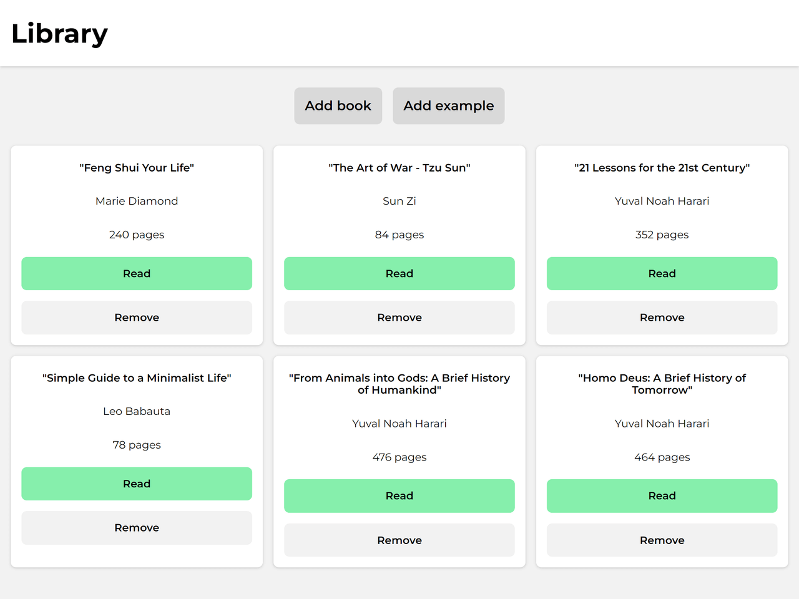

# Library

Library app built using class with constructor method.

Features: 
• Adding new and example books 
• Changing book read status 
• Removing unnessesary books 
• Responsive design 
• Cool transitions 

[Live Demo](https://mariuszciaston.github.io/Library) :point_left:   

| 
------------- | 
